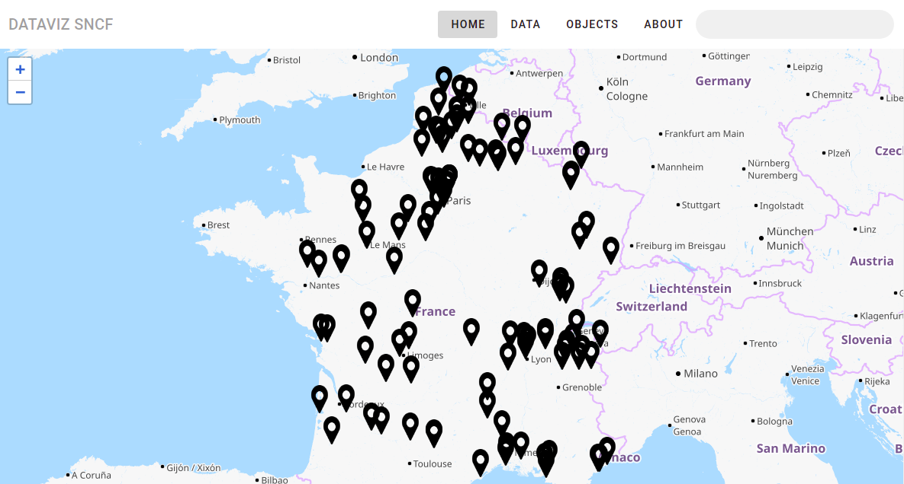

# 🏆 dataviz-vue

This is a data visualization application with the dataSNCF API. It allows you to view the data in the form of a map, graph or table. The aim is to present them to travelers or users in a clear and simple way.

## ⛲ Features

- Display a specific number of stations on a map



- Display the frequency of travelers based on a number of years

![Details view]

- Display statistics of returned and found objects by station, sort by date

![Found view]

- Display the search by station to obtain the regularity of the different types of trains. The display is in the form of a table.

! [Search view]


## 💻 Environment Setup

- Installing NodeJS

Before you can run a VueJS app locally, you must install NodeJS. NodeJs is a JavaScript runtime environment that executes JS code without a browser. For more details, click [here](https://nodejs.org/en/).

- Npm

After installation, (re)start your terminal/CLI interface and type `npm -v`, if you want to know the npm version. [More](https://nodejs.org/en/knowledge/getting-started/npm/what-is-npm/).

- Installing `vue-cli`

Vue-cli is a command line helper for generating and managing VueJS applications.
Use the command : `npm install -g @vue/cli`

- Installing `d3js` and `leaflet`

`npm i vue-d3-charts` and `npm i vue2-leaflet`

- Get the project and launch server

In your terminal, 
```sh
git clone (https://github.com/Desy16/dataviz-vue.git)

cd dataviz-vue
npm run serve
```

### 🧰 Production mode

```sh
git clone https://github.com/Desy16/dataviz-vue.git

cd dataviz-vue
npm run build
```


### 📊 Visualization components

- Map

The home page displays a map that represents all the stations with a popup showing the name, city, zip code and department of the station.

- Bar Chart

On the home page, the popup displays the details of a station.
They present the frequency of travelers by number of years in the form of a bar graph.

- Line Chart

The double-line diagram is used to visualize the statistics of the objects returned and found by station, sort by date.

- Table 

The search bar allows you to find canceled or late trains by station. The result is in tabular form.


### 🕹️ Technical Choices

- VueJS & VuetifyJS

Vue.js, is an open-source JavaScript framework used to build single-page user interfaces and web applications. The entire project was done in VueJs.

Vuetify is a Vue UI Library with beautifully handcrafted Material Components. If you want to know more, go to the [VueJs](https://vuejs.org/v2/guide/) site and the [Vuetify](https://vuetifyjs.com/en/introduction/why-vuetify/).

- Axios 

Axios is a JavaScript library that works as an HTTP client. It allows to communicate with APIs using requests. [More](https://fr.vuejs.org/v2/cookbook/using-axios-to-consume-apis.html)

- Leaflet

Leaflet is an open-source JavaScript library for mobile-friendly interactive maps. For its using with VueJs, [click here](https://vue2-leaflet.netlify.app/). 

- D3js

D3js is a JavaScript library for manipulating documents based on data. D3 helps you bring data to life using HTML, SVG, and CSS. D3’s emphasis on web standards gives you the full capabilities of modern browsers without tying yourself to a proprietary framework, combining powerful visualization components and a data-driven approach to DOM manipulation. [More](https://d3js.org/)


### 👨 Authors

[Desty Mpassi](https://github.com/Desy16/dataviz-vue.git)